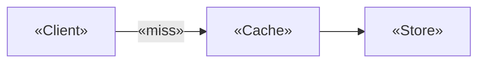

# Visualizations

Graphs, charts, and interactive figures for the HTML page. The goal is understanding you
can't get from prose — not ornament.

## When a visualization earns its place

Add one when it does work prose cannot:

- a **quantity changes** and the shape of the change is the point (growth, latency, hit rate);
- a **structure has topology** — parents, pointers, references, message order;
- a **parameter has a regime** the reader should feel, not read about (what happens at
  TTL = 0, at n = 10⁶, at load factor 0.9);
- the reader must **trace state over steps** and holding it in their head is the hard part.

Skip it when the data is two numbers (write the sentence), when the "chart" would just
re-render a list, or when you'd have to invent the numbers. **Never fabricate data to get a
nicer picture.** If the numbers are estimates, label them as estimates in the caption; if they
come from a benchmark or a source, cite it.

One well-built figure the reader can poke at beats four static decorations.

## What to use for what

| Job | Build |
|---|---|
| Trend, growth, comparison over a range | `Viz.chart` line |
| Discrete comparison across categories (p50/p95/p99, before/after) | `Viz.chart` bar |
| Correlation, spread, individual measurements | `Viz.chart` scatter |
| Trees, pointer structures, graphs, module dependencies | `Viz.graph` |
| Pipeline, request path, message order | `.flow` HTML diagram |
| Two states of the same thing | `.ba` before/after panels |
| State evolving over discrete steps | `.stepper` |
| A parameter the reader should vary | `.viz-control` range input + redraw |
| Mapping, invariant, small table of values | plain `<table>` |

Reuse a small set across the page. Four instances of two families teach better than eight
one-off visuals.

## Fits for a diff explainer

- **Latency or throughput, before versus after** — bar chart over p50/p95/p99, or a line over
  request rate. Only with real numbers: a benchmark you ran, CI timings, a dashboard the user
  pointed you at. No numbers → no chart.
- **A growth curve the change alters** — allocations per request, queue depth over time, cache
  size against TTL. This is where a slider pays: let the reader drag TTL and watch hit rate
  and staleness trade off.
- **Call or dependency structure** — `Viz.graph` for the modules the change touches, with the
  edges it adds or removes marked `dashed` and named in the caption.
- **State machine or lifecycle** — `Viz.graph` with the new transition highlighted via `tag`.
- **Request path** — `.flow`, not `Viz.graph`: a linear pipeline reads better as boxes with
  data on the arrows.
- **Stepper** — for a request traced through the new code path, one panel per hop, with the
  values carried at each. Use it when the change reorders or short-circuits a sequence.

If the change is purely structural — a rename, a type narrowing, an extracted function — a
before/after panel is the whole visual budget. Don't manufacture a chart for it.

## Interactive patterns

All of them are plain DOM and a few lines of JS — no library, no build step.

### Parameter slider driving a chart

```html
<figure>
  <div class="viz-control">
    <label for="load">«Load factor»</label>
    <input type="range" id="load" min="10" max="95" value="70" step="5">
    <output for="load" id="loadOut">0.70</output>
  </div>
  <div id="probeChart"></div>
  <figcaption>«What the reader should notice as they drag.»</figcaption>
</figure>

<script>
(function () {
  var slider = document.getElementById("load");
  var out = document.getElementById("loadOut");
  var mount = document.getElementById("probeChart");

  function redraw() {
    var a = slider.value / 100;
    out.textContent = a.toFixed(2);
    mount.innerHTML = "";                          // cheap and correct at this size
    Viz.chart(mount, {
      type: "line",
      xLabel: "«n»", yLabel: "«probes»",
      aria: "«probes versus n at load factor »" + a.toFixed(2),
      series: [{ name: "«expected probes»", points: «points computed from a» }]
    });
  }
  slider.addEventListener("input", redraw);
  redraw();
})();
</script>
```

Range inputs are keyboard-operable for free. Always mirror the value into an `<output>` so the
current setting is readable, and put the takeaway in the caption — the reader who never drags
still gets the point.

### Stepper over a worked example

Use the `.stepper` block from the template. Each step renders a full state, not a delta, so
jumping in mid-sequence still makes sense. Pair it with `Viz.graph` when the state is a
structure:

```js
var STEPS = [
  { render: function (stage) {
      Viz.graph(stage, { nodes: «…», edges: «…», aria: "«state after union(4,3)»" });
    },
    note: "«What just happened and why it matters»" }
];
```

### Toggle between two states

A single button that swaps the `.ba` panels' content, or re-renders one mount with the other
dataset. Cheaper than a stepper when there are exactly two states, and it makes the
difference land physically.

## Accessibility and honesty

- Every `Viz.chart` and `Viz.graph` call takes `aria` — write a sentence that says what the
  figure shows, not "chart".
- `Viz.chart` emits a collapsible data table by default. Keep it: it is the fallback for
  screen readers, for HTML Reader's sanitized mode, and for anyone who wants the numbers.
  Pass `table: false` only when the same numbers are already in the prose.
- Series are distinguished by **dash pattern and legend glyph as well as color**. Do not
  replace that with color-only styling.
- Interactive controls must be reachable by keyboard and must have a visible focus ring — the
  template's `:focus-visible` rules cover the standard elements.
- Label axes with units. An unlabeled y-axis is a decoration.

## Obsidian reality

The charts are inline SVG driven by JS, so they live in the HTML page and render **in a
browser**. Inside Obsidian, HTML Reader sanitizes scripts and the figures will be empty — this
is the same limitation as the quiz, and the data tables are what survive.

The `.md` stub is different: Obsidian renders **Mermaid natively**, no plugin. When the note
has one structural idea worth carrying without opening the page, put a small Mermaid diagram
in the stub:

````markdown

````

Keep it to one diagram and under ~10 nodes. The stub is a summary, not a second copy of the
page.

## The Viz block

Paste both blocks into the page when it has charts or node-link diagrams. The CSS goes at the
end of the `<style>` element, the JS above the other `<script>` blocks. Delete both if the
page has neither.

### CSS

```css
  /* Viz — charts and node-link graphs. Paired with the Viz JS block; delete both if unused. */
  :root { --s0:#3b6db5; --s1:#1f7a45; --s2:#a1622a; --s3:#7a3b9b; }
  @media (prefers-color-scheme: dark) {
    :root { --s0:#7aa7e6; --s1:#6cc38c; --s2:#d79a63; --s3:#b98bd6; }
  }
  .viz { display:block; width:100%; height:auto; overflow:visible; }
  .viz .grid { stroke:var(--line); stroke-width:1; }
  .viz .axis { stroke:var(--muted); stroke-width:1; }
  .viz .tick, .viz .axis-label { fill:var(--muted); font-size:11px;
        font-family:-apple-system, BlinkMacSystemFont, "Segoe UI", sans-serif; }
  .viz .axis-label { font-size:11px; letter-spacing:.03em; }
  .viz .line { stroke-width:2; stroke-linejoin:round; stroke-linecap:round; }
  .viz .bar { opacity:.9; }
  .viz .s0 { stroke:var(--s0); } .viz rect.s0, .viz circle.s0 { fill:var(--s0); stroke:none; }
  .viz .s1 { stroke:var(--s1); } .viz rect.s1, .viz circle.s1 { fill:var(--s1); stroke:none; }
  .viz .s2 { stroke:var(--s2); } .viz rect.s2, .viz circle.s2 { fill:var(--s2); stroke:none; }
  .viz .s3 { stroke:var(--s3); } .viz rect.s3, .viz circle.s3 { fill:var(--s3); stroke:none; }
  .viz .gedge { stroke:var(--muted); stroke-width:1.5; }
  .viz .gedge.dashed { stroke-dasharray:5 3; }
  .viz .gedge-label { fill:var(--muted); font-size:11px;
        font-family:-apple-system, BlinkMacSystemFont, "Segoe UI", sans-serif; }
  .viz .arrowhead { fill:var(--muted); }
  .viz .gnode circle { fill:var(--card); stroke:var(--accent); stroke-width:1.5; }
  .viz .gnode text { fill:var(--fg); font-size:12px;
        font-family:ui-monospace, SFMono-Regular, Menlo, monospace; }
  .viz .gnode.root circle { stroke-width:3.5; }
  .viz .gnode.muted circle { stroke:var(--muted); stroke-dasharray:3 2; }
  .viz-legend { display:flex; flex-wrap:wrap; gap:1.1rem; margin-top:.5rem;
                font-size:.82rem; color:var(--muted); }
  .viz-key.s0 { color:var(--s0); } .viz-key.s1 { color:var(--s1); }
  .viz-key.s2 { color:var(--s2); } .viz-key.s3 { color:var(--s3); }
  .viz-data { margin-top:.6rem; font-size:.85rem; }
  .viz-data summary { color:var(--muted); font-weight:400; }
  .viz-data table { margin:.5rem 0 0; }

  /* Range control for parameter-driven figures */
  .viz-control { display:flex; align-items:center; gap:.6rem; margin:.6rem 0 .2rem;
                 font-size:.88rem; flex-wrap:wrap; }
  .viz-control input[type=range] { flex:1 1 12rem; accent-color:var(--accent); }
  .viz-control output { font-family:ui-monospace, Menlo, monospace; color:var(--muted);
                        min-width:4rem; }
```

### JS

```js
/* Viz — dependency-free SVG charts and node-link graphs. Keep as one block; delete if unused. */
var Viz = (function () {
  "use strict";
  var NS = "http://www.w3.org/2000/svg";
  var DASH = ["", "6 3", "2 3", "8 3 2 3"];          // series identity without relying on color

  function svgEl(tag, attrs) {
    var n = document.createElementNS(NS, tag);
    for (var k in attrs) if (attrs[k] != null) n.setAttribute(k, attrs[k]);
    return n;
  }
  function extent(vals) {
    var lo = Math.min.apply(null, vals), hi = Math.max.apply(null, vals);
    if (lo === hi) { lo -= 1; hi += 1; }
    return [lo, hi];
  }
  function fmt(v) {
    if (Math.abs(v) >= 1000) return (v / 1000) + "k";
    return Math.round(v * 100) / 100 + "";
  }

  /* spec: {type:"line"|"bar"|"scatter", series:[{name, points:[[x,y],…]}],
            xLabel, yLabel, height, yZero:true, xTickLabels:["a","b"], caption, table:true} */
  function chart(mount, spec) {
    var W = 640, H = spec.height || 300, P = { t: 16, r: 16, b: 42, l: 52 };
    var series = spec.series || [];
    var xs = [], ys = [];
    series.forEach(function (s) {
      s.points.forEach(function (p) { xs.push(p[0]); ys.push(p[1]); });
    });
    if (!xs.length) return;
    var xe = extent(xs), ye = extent(ys);
    if (spec.yZero !== false) ye[0] = Math.min(0, ye[0]);

    var sx = function (v) { return P.l + (v - xe[0]) / (xe[1] - xe[0]) * (W - P.l - P.r); };
    var sy = function (v) { return H - P.b - (v - ye[0]) / (ye[1] - ye[0]) * (H - P.t - P.b); };

    var svg = svgEl("svg", {
      viewBox: "0 0 " + W + " " + H, class: "viz",
      role: "img", "aria-label": spec.aria || spec.caption || "chart"
    });

    [0, 0.25, 0.5, 0.75, 1].forEach(function (f) {             // y gridlines + labels
      var v = ye[0] + f * (ye[1] - ye[0]), y = sy(v);
      svg.appendChild(svgEl("line", { x1: P.l, x2: W - P.r, y1: y, y2: y, class: "grid" }));
      var t = svgEl("text", { x: P.l - 8, y: y + 4, class: "tick", "text-anchor": "end" });
      t.textContent = fmt(v);
      svg.appendChild(t);
    });

    var ticks = spec.xTickLabels || null;
    var n = ticks ? ticks.length : 5;
    for (var i = 0; i < n; i++) {
      var f2 = n === 1 ? 0 : i / (n - 1);
      var xv = xe[0] + f2 * (xe[1] - xe[0]);
      var tx = svgEl("text", { x: sx(xv), y: H - P.b + 18, class: "tick", "text-anchor": "middle" });
      tx.textContent = ticks ? ticks[i] : fmt(xv);
      svg.appendChild(tx);
    }
    svg.appendChild(svgEl("line", { x1: P.l, x2: W - P.r, y1: sy(ye[0]), y2: sy(ye[0]), class: "axis" }));

    if (spec.yLabel) {
      var yl = svgEl("text", { x: 12, y: P.t + 4, class: "axis-label" });
      yl.textContent = spec.yLabel; svg.appendChild(yl);
    }
    if (spec.xLabel) {
      var xl = svgEl("text", { x: W - P.r, y: H - 6, class: "axis-label", "text-anchor": "end" });
      xl.textContent = spec.xLabel; svg.appendChild(xl);
    }

    series.forEach(function (s, si) {
      var cls = "s" + (si % 4);
      if (spec.type === "bar") {
        var bw = (W - P.l - P.r) / (s.points.length * series.length) * 0.7;
        s.points.forEach(function (p, pi) {
          var x = sx(p[0]) - (series.length * bw) / 2 + si * bw;
          svg.appendChild(svgEl("rect", {
            x: x, y: sy(p[1]), width: bw, height: Math.max(1, sy(ye[0]) - sy(p[1])),
            class: "bar " + cls
          }));
        });
      } else if (spec.type === "scatter") {
        s.points.forEach(function (p) {
          svg.appendChild(svgEl("circle", { cx: sx(p[0]), cy: sy(p[1]), r: 3.5, class: "dot " + cls }));
        });
      } else {
        var d = s.points.map(function (p, pi) {
          return (pi ? "L" : "M") + sx(p[0]) + " " + sy(p[1]);
        }).join(" ");
        svg.appendChild(svgEl("path", {
          d: d, class: "line " + cls, fill: "none", "stroke-dasharray": DASH[si % DASH.length]
        }));
      }
    });

    mount.appendChild(svg);

    if (series.length > 1) {                                    // legend, shape-coded not color-only
      var leg = document.createElement("div");
      leg.className = "viz-legend";
      series.forEach(function (s, si) {
        var item = document.createElement("span");
        item.className = "viz-key s" + (si % 4);
        item.textContent = (["———", "– – –", "· · ·", "–·–·"][si % 4]) + " " + s.name;
        leg.appendChild(item);
      });
      mount.appendChild(leg);
    }

    if (spec.table !== false) {                                 // data table fallback
      var det = document.createElement("details");
      det.className = "viz-data";
      var sum = document.createElement("summary");
      sum.textContent = spec.tableLabel || "Data";
      det.appendChild(sum);
      var tbl = document.createElement("table");
      var head = "<tr><th>" + (spec.xLabel || "x") + "</th>" +
        series.map(function (s) { return "<th>" + s.name + "</th>"; }).join("") + "</tr>";
      var rows = series[0].points.map(function (p, pi) {
        return "<tr><td>" + (ticks ? ticks[pi] || fmt(p[0]) : fmt(p[0])) + "</td>" +
          series.map(function (s) { return "<td>" + (s.points[pi] ? fmt(s.points[pi][1]) : "—") + "</td>"; }).join("") +
          "</tr>";
      }).join("");
      tbl.innerHTML = head + rows;
      det.appendChild(tbl);
      mount.appendChild(det);
    }
    return svg;
  }

  /* spec: {nodes:[{id,label,x,y,tag}], edges:[{from,to,label,dashed}], height} — x/y in any units */
  function graph(mount, spec) {
    var nodes = spec.nodes, edges = spec.edges || [];
    var byId = {}; nodes.forEach(function (n) { byId[n.id] = n; });
    var W = 640, H = spec.height || 300, M = 40, R = spec.radius || 18;
    var xe = extent(nodes.map(function (n) { return n.x; }));
    var ye = extent(nodes.map(function (n) { return n.y; }));
    var sx = function (v) { return M + (v - xe[0]) / (xe[1] - xe[0]) * (W - 2 * M); };
    var sy = function (v) { return M + (v - ye[0]) / (ye[1] - ye[0]) * (H - 2 * M); };

    var svg = svgEl("svg", {
      viewBox: "0 0 " + W + " " + H, class: "viz",
      role: "img", "aria-label": spec.aria || "diagram"
    });
    var defs = svgEl("defs");
    var mk = svgEl("marker", {
      id: "arrow", viewBox: "0 0 10 10", refX: 9, refY: 5,
      markerWidth: 6, markerHeight: 6, orient: "auto-start-reverse"
    });
    mk.appendChild(svgEl("path", { d: "M0 0 L10 5 L0 10 z", class: "arrowhead" }));
    defs.appendChild(mk); svg.appendChild(defs);

    edges.forEach(function (e) {
      var a = byId[e.from], b = byId[e.to];
      if (!a || !b) return;
      var x1 = sx(a.x), y1 = sy(a.y), x2 = sx(b.x), y2 = sy(b.y);
      var dx = x2 - x1, dy = y2 - y1, len = Math.sqrt(dx * dx + dy * dy) || 1;
      var ox = dx / len * R, oy = dy / len * R;
      svg.appendChild(svgEl("line", {
        x1: x1 + ox, y1: y1 + oy, x2: x2 - ox, y2: y2 - oy,
        class: "gedge" + (e.dashed ? " dashed" : ""), "marker-end": "url(#arrow)"
      }));
      if (e.label) {
        var t = svgEl("text", { x: (x1 + x2) / 2, y: (y1 + y2) / 2 - 6, class: "gedge-label", "text-anchor": "middle" });
        t.textContent = e.label; svg.appendChild(t);
      }
    });

    nodes.forEach(function (n) {
      var g = svgEl("g", { class: "gnode" + (n.tag ? " " + n.tag : "") });
      g.appendChild(svgEl("circle", { cx: sx(n.x), cy: sy(n.y), r: R }));
      var t = svgEl("text", { x: sx(n.x), y: sy(n.y) + 4, "text-anchor": "middle" });
      t.textContent = n.label;
      g.appendChild(t);
      svg.appendChild(g);
    });

    mount.appendChild(svg);
    return svg;
  }

  return { chart: chart, graph: graph };
})();
```

### API

```js
Viz.chart(mountEl, {
  type: "line" | "bar" | "scatter",     // default line
  series: [{ name: "before", points: [[x, y], …] }, …],
  xLabel: "n", yLabel: "ops",
  xTickLabels: ["p50", "p95", "p99"],   // optional; categorical x
  yZero: true,                          // default true — force the y-axis to include 0
  height: 300,
  aria: "one sentence describing the figure",
  table: true,                          // default true — collapsible data table
  tableLabel: "Данные"
});

Viz.graph(mountEl, {
  nodes: [{ id: "a", label: "3", x: 0, y: 1, tag: "root" | "muted" }, …],
  edges: [{ from: "a", to: "b", label: "parent", dashed: false }, …],
  height: 300,
  radius: 18,
  aria: "one sentence describing the structure"
});
```

`Viz.graph` takes explicit `x`/`y` in any units and scales them to the viewport — compute the
layout yourself. For a tree, `x` is horizontal position within the level and `y` is the depth;
give the root the midpoint `x` of its children, or the scaling will pin it to one edge. Edges
draw an arrowhead at the `to` end; for a parent pointer, that means `{from: child, to:
parent}`. Both axes stretch to fill, so a two-node figure lands corner to corner — add the
surrounding nodes, or pad the coordinates, when that reads badly.
